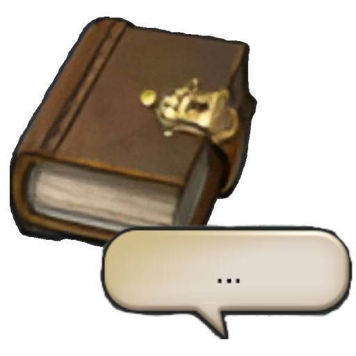

# Cutscene Transcripts

Cutscene Transcripts records dialog boxes shown during cutscenes and displays them in a native in-game transcript window. It is intended as a lightweight accessibility and review tool for players who miss a line, need a moment to reread, or want to replay captured voiced dialogue while the cutscene is still fresh.

This plugin uses KamiToolKit for its cutscene button and transcript window so the UI behaves like a normal game window rather than a separate ImGui overlay.

> [!IMPORTANT]
> This plugin only records dialogue and choice text that is already visible to the local player.
>
> It does not advance dialogue, pick choices, automate cutscenes, or make decisions for the player.

## Features

### Talk Capture

The `Talk` addon is sampled while a cutscene is active. Candidate text fields are normalized and deduplicated before being written to the current transcript.

### Choice Capture

Cutscene-adjacent choice addons are tracked long enough to record the selected option as a player line. This is intentionally scoped to active or recently active cutscene flows to avoid capturing ordinary menu choices.

### Voice Replay

Likely voice assets are matched from the active game sound list and attached to transcript rows when possible. Some captured voice references may be shown as unavailable when the sound data is not reliable enough to replay.

### Native Transcript UI

The transcript window and cutscene button are native KamiToolKit elements. The regular settings window remains a Dalamud Windowing window and is hidden while cutscenes are active.

## Commands

```text
/cutscenetranscript
/cstranscript
```

Use `/cutscenetranscript config` for settings and `/cutscenetranscript clear` to clear the current transcript.

## Project Layout

- `Classes`: persisted configuration and small transcript/capture state models.
- `Features`: behavior grouped by capture or UI responsibility.
- `NativeElements`: KamiToolKit addon/window implementations.
- `Utilities`: plain text helpers shared by capture and export code.

# Contributing

Keep new code grouped by the system it changes. If a change touches native UI, put the KTK-facing code under `NativeElements`; if it changes capture behavior, put it under the relevant `Features` folder or create a new feature folder with a descriptive name.

Comments should explain native-game assumptions, lifecycle hazards, or non-obvious heuristics. Prefer descriptive file, type, and method names over repeating what the code already says.
